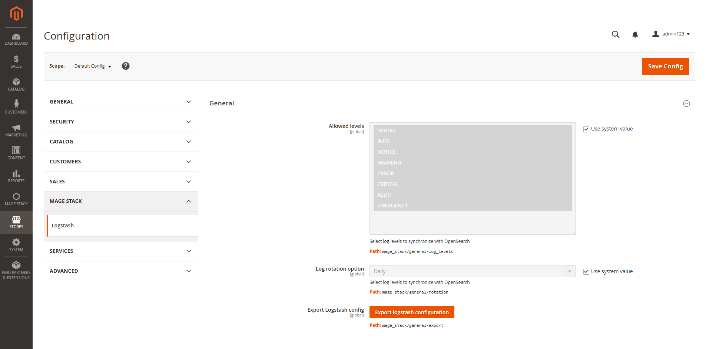
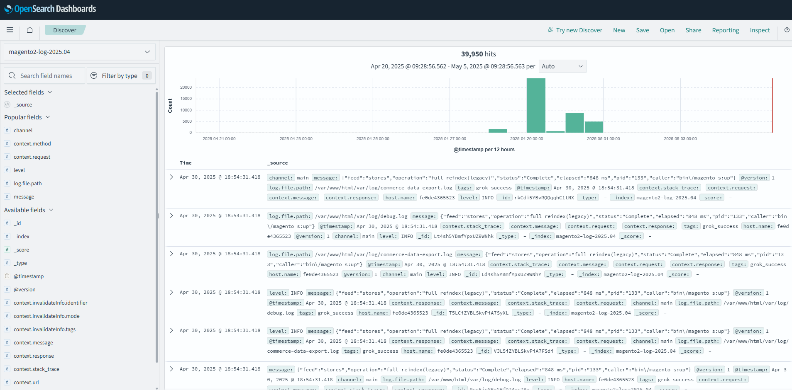
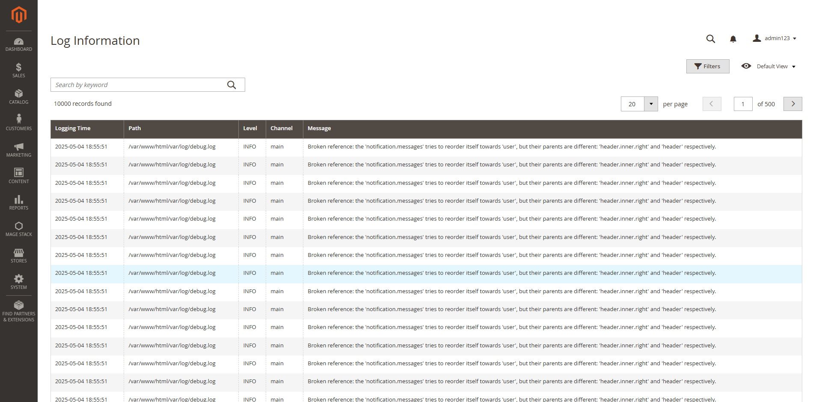
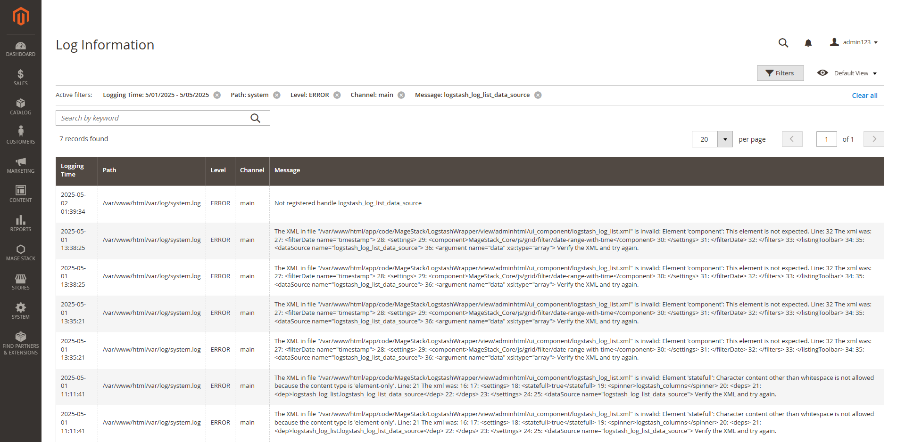

# Mage2 Module: Mage Stack Logstash Wrapper
MageStack_LogstashWrapper is a Magento 2 module designed to streamline the integration between Magento and Logstash. It enables developers and administrators to easily view and filter logs from OpenSearch (via Logstash) directly within the Magento admin panel.

## Requirements
- Magento 2.4.8
- PHP 8.4
- Opensearch
- Logstash
- MageStack Core module
    ``composer require mage-stack/module-core``
- MageStack Opensearch module
    ``composer require mage-stack/module-opensearch``

## Module version
- 1.0.0

## Main Functionalities
- Generate logstash configurartion depending upon your existing confiuration
- Display log in admin grid
- Filter and search logs from admin

## Installation
1. **Install the module via Composer**:
    To install this module, run the following command in your Magento root directory:
    - ``composer require mage-stack/module-logstash-wrapper``
2. **Enable the module:**
    After installation, enable the module by running:
   - ``php bin/magento module:enable MageStack_LogstashWrapper``
3. **Apply database updates:**
    Run the setup upgrade command to apply any database changes:
    - ``php bin/magento setup:upgrade``
4. **Flush the Magento cache:**
    Finally, flush the cache:
   -  ``php bin/magento cache:flush``

## Usage
This module provides a complete logging solution for Magento 2, integrated with OpenSearch and enhanced with admin-side configurability and visibility.

- **Admin Configuration for Log Levels** 
   Configure which log levels (debug, info, notice, warning, error, critical, etc.) should be sent to OpenSearch directly from the Magento admin panel. This ensures only relevant logs are indexed, helping reduce noise and optimize storage.
   

- **Export Logstash Configuration**
    Easily export a ready-to-use Logstash configuration file tailored for your Magento instance. This helps in quick integration and reduces manual configuration errors while setting up the log pipeline to OpenSearch.
    <pre>
    ````
        input {
            file {
                path => "/absolute/path/to/your/log/directory/**/*.log"
                start_position => "beginning"
                codec => multiline {
                    pattern => "^\[.*\]"
                    negate => true
                    what => "previous"
                }
            }
        }

        filter {
            grok {
                match => {
                    "message" => "\[%{TIMESTAMP_ISO8601:timestamp}\] %{WORD:channel}\.%{LOGLEVEL:level}: %{GREEDYDATA:raw_log}"
                }
                add_tag => ["grok_success"]
                remove_tag => ["_grokparsefailure"]
            }

            if !([level] in ["DEBUG", "INFO", "NOTICE", "WARNING", "ERROR", "CRITICAL", "ALERT", "EMERGENCY"]) {
                drop { }
            }

            date {
                match => ["timestamp", "ISO8601"]
                target => "@timestamp"
            }

            grok {
                match => {
                    "raw_log" => [
                        "(?m)^(?<clean_message>.*?)\s(?<context_json>\{.*?\})\s(?<extra_json>\{.*?\})$",
                        "(?m)^(?<clean_message>.*?)\s(?<context_json>\{.*?\})\s(\[\])$",
                        "(?m)^(?<clean_message>.*?)\s(\[\])\s(?<extra_json>\{.*?\})$",
                        "(?m)^(?<clean_message>.*?)\s(\[\])\s(\[\])$",
                        "(?m)^(?<clean_message>.*?)$"
                    ]
                }
            }

            if [context_json] {
                mutate {
                    gsub => [
                        "context_json", "\n", " ",
                        "context_json", "\r", " ",
                        "context_json", "\s+", " "
                    ]
                }
                ruby {
                    code => "
                        require 'json'
                        ctx = event.get('context_json')
                        if ctx && !ctx.empty?
                            begin
                                parsed = JSON.parse(ctx)
                                event.set('context', parsed)
                                event.remove('context_json')
                            rescue JSON::ParserError
                                event.set('context_string', ctx)
                                event.remove('context')
                                event.remove('context_json')
                            end
                        else
                            event.set('context_string', 'No valid JSON')
                            event.remove('context')
                            event.remove('context_json')
                        end
                    "
                }
            }

            if [extra_json] {
                json {
                    source => "extra_json"
                    target => "extra"
                    skip_on_invalid_json => true
                }
            }

            mutate {
                rename => { "clean_message" => "message" }
                remove_field => ["timestamp", "raw_log", "extra_json", "event"]
            }
        }

        output {
            opensearch {
                hosts => ["http://opensearch-host:port"]
                index => "log-index-prefix-%{+YYYY.MM.dd}"
                ssl => true
                ssl_certificate_verification => true
            }
        }
    ````
    </pre>
- **View Logs in OpenSearch Dashboard**
    Logs sent to OpenSearch can be viewed and analyzed in dashboards like Kibana or OpenSearch Dashboards. Gain insights with filters, charts, and visualizations to monitor issues or performance trends.
    
    
- **Admin Panel Log Grid**
    A dedicated admin grid displays the collected logs inside Magento. This grid provides pagination, search, and sorting, giving developers and admins a centralized place to monitor logs without leaving the Magento backend.
    

- **Advanced Search and Filtering**
    Search and filter logs within the Magento grid or OpenSearch using fields like:
    - **Log Path** – Identify the source file or module.
    - **Date Range** – View logs within a specific timeframe.
    - **Log Levels** – Filter by severity (e.g., error, debug).
    - **Keywords** – Search within the message body for quick debugging.
    
    
## Upcoming features
- **Detailed Log View**
    Click on a log entry in the admin grid to view full details including context, stack trace, extra metadata, and any structured data attached.
- **Export Logs**
    Allow exporting selected log entries from the admin panel (in CSV, JSON, etc.) for sharing, auditing, or offline analysis.
- **Enable or Disable Log Viewer**
    Add configuration options to enable or disable the log viewer module entirely, allowing more control over performance and visibility based on environment (e.g., production vs development).

## Contributing
If you would like to contribute to this module, feel free to fork the repository and create a pull request. Please make sure to follow the coding standards of Magento 2.

## Reporting Issues
If you encounter any issues or need support, please create an issue on the GitHub Issues page. We will review and address your concerns as soon as possible.

## License
This module is licensed under the MIT License.

## Support
If you find this module useful, consider supporting me By giving this module a star on github